# Thesis

# Louis Armstrong - Anatomy of an Artist

## Outline

### Questions:

How has Louis Armstrong’s legacy been represented over time?
What has allowed his impact on American culture to endure for so long?
And why should his influence both as a groundbreaking artist and as an informal ambassador of the United States receive greater recognition than it often does?
Who is Louis Armstrong as one of the first ‘Jazz’ artists?
What is Jazz and why is it the greatest genre and type of music to originate from America?
Louis Armstrongs’s childhood and his significant impact on music, blues, jazz, pop and all that followed. As the first Black pop star.

### Significance:

Louis Armstrong was a genius and his career and life was multifaceted, yet most remember him only as a musician. As the first "Black Pop" star that set the stage for many black and white artists that followed he is remembered for one facet of his life.

### Purpose:

Help bring awareness to the anatomy of an artist like Louis Armstrong and the important contributions to culture, history and art that he made that was foundational to the U.S. and made America a place to be admired and respected.

### Table of Contents

### Treatment

#### 1. A multi-faceted life. Examples of each category (as data visualizations):

Musician
Instrumentalist
Singer
Band Leader
Ambassador
Actor
Artist (collages)
Husband
Neighbor
Friend
Activist
Humanitarian

#### 2. Artforms, media, film and music that placed America in the spotlight when it came to art and innovation. How Louis Armstrong was one of the first to contribute to the reputation of America as a place to dream of.

#### 3. Timeline of the beginning of Jazz, Louis Armstrong’s childhood to professional career with the backdrop of American History between 1900-1971.

Conclusion
1971 his passing.
His Legacy today.
Todays re recordings
The organizations that honor him
How is he remembered today and how should we remember him?

### Sources

Louis Armstrong House Museum 
Louis Armstrong Educational Foundation 
Smithsonian National Museum of African American History & Culture 
Schomburg Center for Research 
Public-domain audio archives 1900-1925 
"Stomp Off, Let's Go: The Early Years of Louis Armstrong," Ricky Riccadi.  
"What a Wonderful World: The Magic of Louis Armstrong's Later Years", Ricky Riccadi.

# Introduction & Abstract

## Introduction

This thesis and accompanying data visualization project examine how Louis Armstrong’s legacy has been represented, remembered, and sustained over time. His legacy is reimagined and reassessed to highlight his multi-faceted artistry and its enormity that deserves more credit than it has been given. While Armstrong is widely celebrated as a pioneering jazz musician, this project argues that his cultural impact extends far beyond music. As one of the first Black global pop stars, opening the doors to Black entertainers, an ambassador of the United States, and a major cultural figure of his time, Armstrong played a foundational role in shaping twentieth century American identity, artistic innovation, and international diplomacy.

## Abstract

The project investigates four central questions: How has Louis Armstrong’s legacy been constructed across history? Why career choices were made by Black entertainers of his time and under what historical context were their decisions tied to. What conditions have made Louis Armstrong;s influence on American culture endure for over a century? Why should his role as both a groundbreaking artist and cultural diplomat receive greater recognition? This project will draw from archival materials from the Louis Armstrong House Museum, the Louis Armstrong Educational Foundation, the Smithsonian National Museum of African American History & Culture, the Schomburg Center for Research, and public-domain audio archives between 1900–1925. The research will include historical, musical, political, and cultural data displayed as an analytical framework that answers the four central questions.

The creative component translates this research into a series of data visualizations that map the anatomy of an artist like Armstrong’s whose work crossed musical categories and roles such as musician, instrumentalist, singer, bandleader, ambassador, actor, visual artist, activist, humanitarian, husband, son and private citizen. A historical timeline sets his life (1900–1971) within broader American social and political developments, such as Prohibition and The Great Depression as well the state of global affairs, that includes Word War II, to demonstrate how jazz emerged alongside modern America and how Armstrong became central to its global cultural reputation.

Other data visualizations examine Louis Armstrong’s career decisions, his public statements during the unrest of the Civil Rights movement, and his role as a global ambassador of American culture. The project analyzes how his international tours promoting jazz positioned him as a representative and ambassador of American freedom and creativity abroad, even as racial injustice and segregation persisted at home. These visualizations explore the tension between Armstrong’s role in projecting a preferred image of the United States to the world and the realities faced by Black Americans during the same period. By mapping performances, political events, public commentary, and media narratives, the project highlights how cultural diplomacy through jazz both advanced American power and, at times, functioned as a distraction from domestic inequalities.

Additional visual analyses examine recordings, re-recordings, performances, and media appearances to trace the evolution of Armstrong’s public image and legacy. Expanding beyond his professional life, the project also includes data visualizations of Armstrong as a collage artist, mapping themes, materials, and visual motifs across his handmade works to reveal an often overlooked dimension of his creative practice. Further visualizations situate him within his Queens neighborhood community, illustrating patterns of correspondence and local relationships to portray Armstrong as neighbor and private citizen.

Sentiment and network analyses of interviews, tributes, and critical writings visualize how fellow musicians and cultural figures described and interpreted him over time, offering a comparative view of his reputation across generations of artists. Together, these visual frameworks broaden the understanding of Armstrong’s legacy beyond performance, positioning him as a multidimensional cultural figure whose influence resonated across artistic, social, and personal spheres.

The project combines archival research, historical analysis and AI data modeling. Primary data structures include chronological datasets, categorical taxonomies of roles, network maps of collaborations and media appearances, and geographic maps of performances and diplomatic tours. By transforming qualitative cultural history into visual data, the project goes beyond individual artifacts to reveal patterns about race, media and national identity in the twentieth century.

This thesis positions Armstrong not only as a musician but as a lens through which to understand America, culturally, politically and artistically. It contributes to the field of data visualization by showing how visualization can be used to interpret cultural history, connecting quantitative analysis with humanistic research. Addressed to scholars, data designers, historians, and the general public, the project argues for a more expansive remembrance of Louis Armstrong. Not only as a jazz icon but as a foundational figure who continues to shape contemporary music, diplomacy, and global artistic imagination.

# Sketches and Visualizations for Thesis

# Anatomy of an Artist

 

## Louis Armstrong: A Data Portrait in 2000 Facts

#### Visualization: custom

Description: Louis Armstrong’s life as 2000 facts that can be discovered. Masked around an iconic silhouette of Louis Armstrong’s head and shoulders, these facts are searchable. Louis Armstrong's name is recognizable but most do not know who he was and what he accomplsied throughtout his life and beyond. This visualization will show who Armstrong is through facts that are well known and other facts that less commonly known.

## Louis Armstrong’s World Tour: A Map of Influence

#### Visualization: map

Description: The enormity of Louis Armstrong's life and influence across time and space. He performed in many cities across the world and his influence is still felt today. This map will show the locations of Armstrong's performances and the influence he had on other musicians and artists.

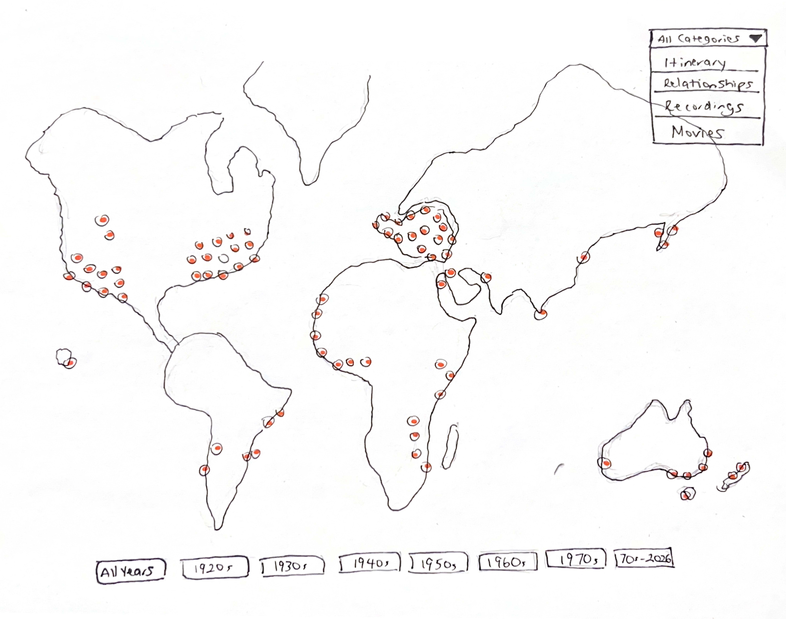

## The History Behind Louis Armstrong

#### Visualization: timeline

Description: The chronological journey of Louis Armstrong's life and career. This timeline will show the key events in Armstrong's life, including his birth, early life, career milestones, and legacy. It will also show the role history played on decisions Louis Armstrong made. With events such as the Great Depression, World War II, and the Civil Rights Movement, Armstrong's life and career were shaped by the historical context in which he lived. This timeline will show how these events influenced Armstrong's decisions and how he navigated the challenges of his time.

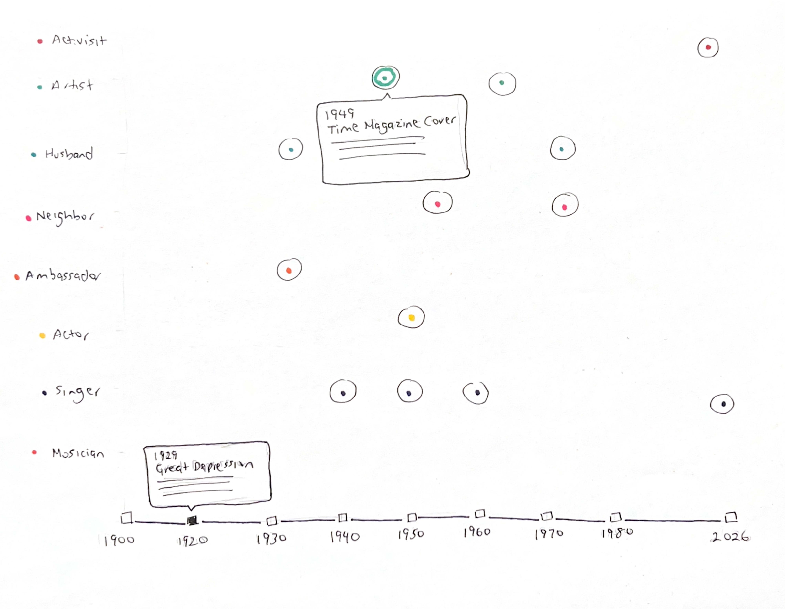

## Discovering Armstrong: A Randomized Curation

#### Visualization: virtual curation

Description: This data visualization presents Louis Armstrong's life and work in an interactive virtual curation format. Users can explore his musical legacy through curated collections of performances, recordings, and historical artifacts.

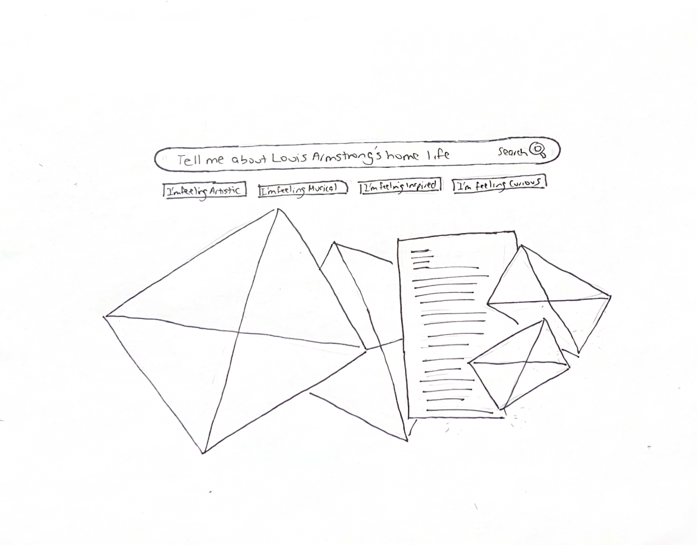

## The Louis Armstrong Ripple Effect: A Network of Influence

#### Visualization: network graph

Description: This visualization shows Louis Armstrong’s legacy as a single continuous sound wave. Each vertical bar represents one original song, arranged chronologically, with the height indicating how many cover versions it has generated. Larger bars reflect songs with greater cultural resonance. Together, the waveform illustrates how his music continues to echo across generations.

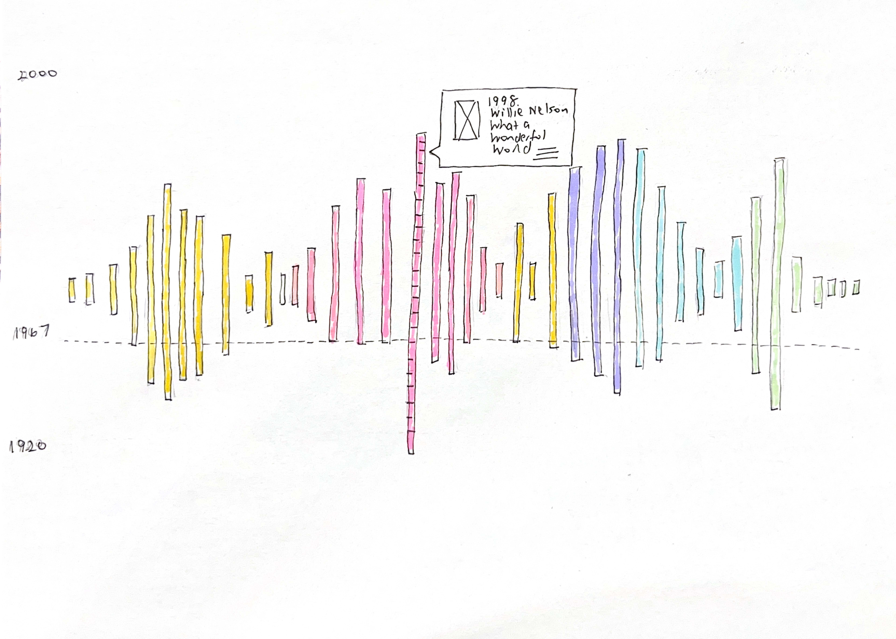

# Design Visualizations for Thesis

# Anatomy of an Artist

 

## Louis Armstrong: A Data Portrait in 1901 Facts

#### Visualization: custom

Description: Louis Armstrong’s life as 2000 facts that can be discovered. Masked around an iconic silhouette of Louis Armstrong’s head and shoulders, these facts are searchable. Louis Armstrong's name is recognizable but most do not know who he was and what he accomplsied throughtout his life and beyond. This visualization will show who Armstrong is through facts that are well known and other facts that less commonly known.

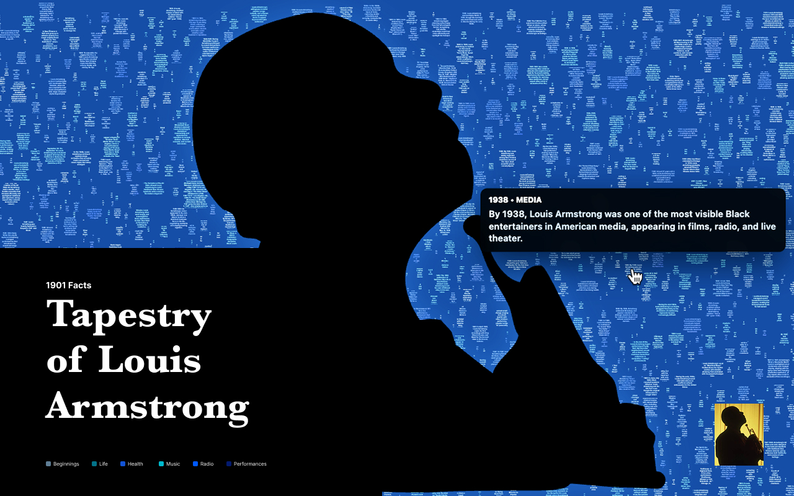

## Louis Armstrong Opinions

#### Visualization: custom

Description: This visualization will show the opinions of Louis Armstrong. It will show the opinions of people who knew him, people who were influenced by him, and people who have studied him. This visualization will show the different perspectives on Louis Armstrong and how he is viewed by different people.

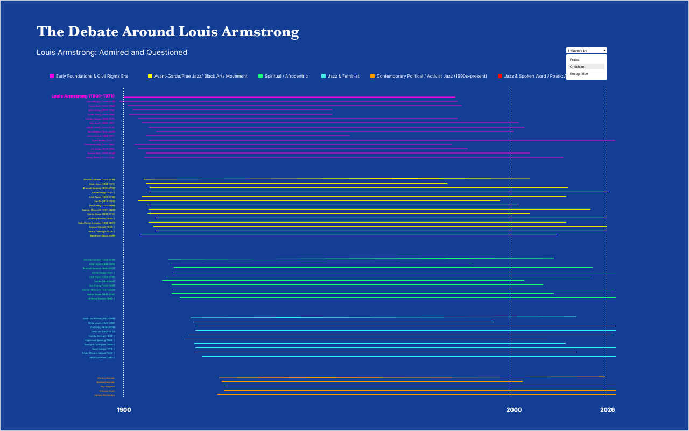

## The History Behind Louis Armstrong

#### Visualization: timeline

Description: The chronological journey of Louis Armstrong's life and career. This timeline will show the key events in Armstrong's life, including his birth, early life, career milestones, and legacy. It will also show the role history played on decisions Louis Armstrong made. With events such as the Great Depression, World War II, and the Civil Rights Movement, Armstrong's life and career were shaped by the historical context in which he lived. This timeline will show how these events influenced Armstrong's decisions and how he navigated the challenges of his time.

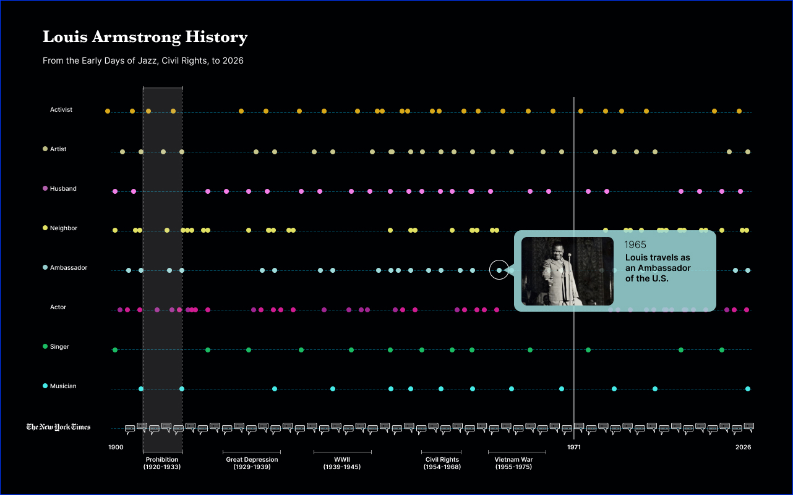

## Louis Armstrong’s World Tour: A Map of Influence

#### Visualization: map

Description: The enormity of Louis Armstrong's life and influence across time and space. He performed in many cities across the world and his influence is still felt today. This map will show the locations of Armstrong's performances and the influence he had on other musicians and artists.

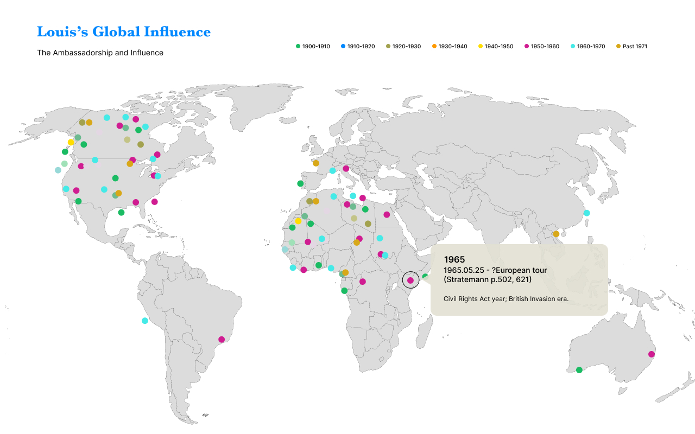

## Louis Armstrong’s Original Songs: A Network of Influence

#### Visualization: line charts

Description: This visualization will show the influence of Louis Armstrong's original songs. It will show how many cover versions each song has generated and how many people have been influenced by each song.

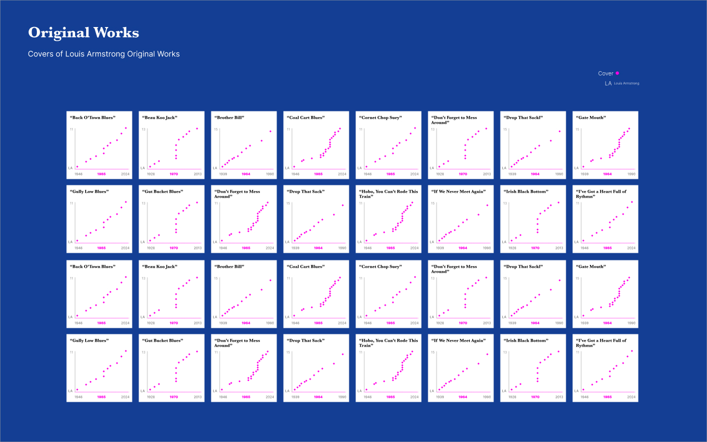

## Louis Armstrong’s What a Wonderful World

#### Visualization: custom

Description: This visualization will show the influence of Louis Armstrong's song "What a Wonderful World". It will show how many cover versions the song has generated and how many people have been influenced by this song.

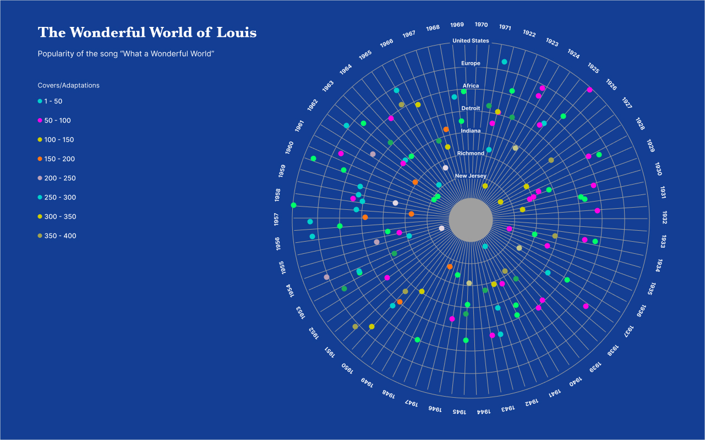

## Louis Armstrong’s Re-recordings

#### Visualization: custom

Description: This visualization will show the impact of Louis Armstrong's re-recordings and how they continue to influence people today.

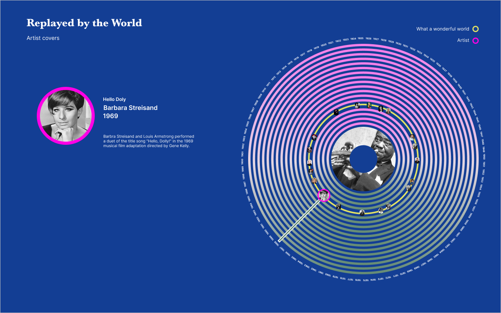
