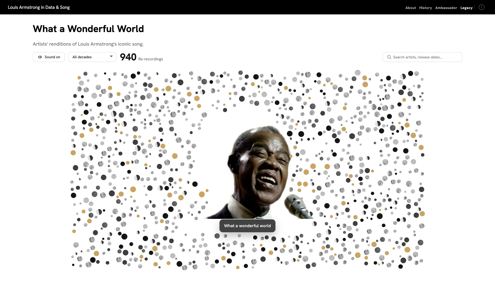
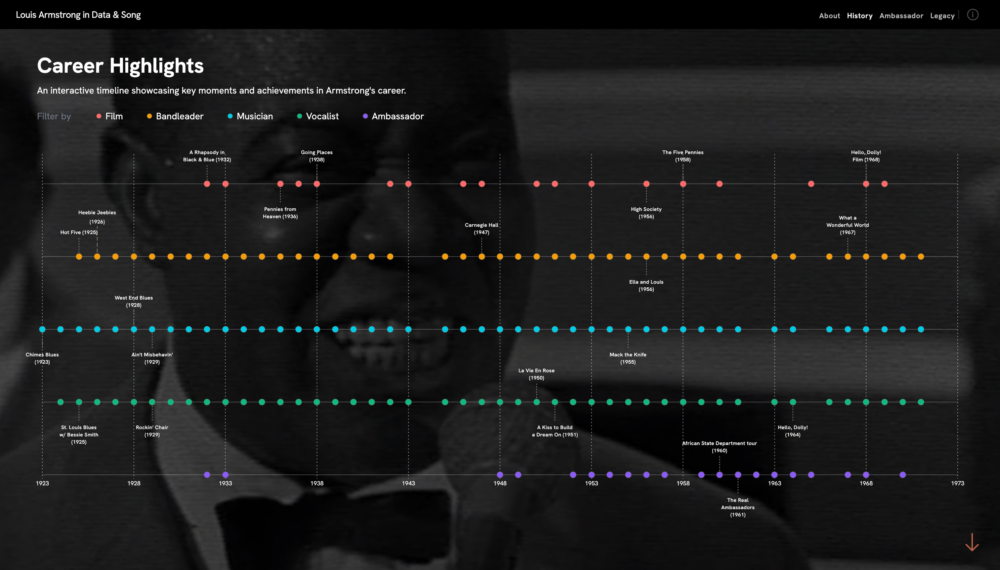
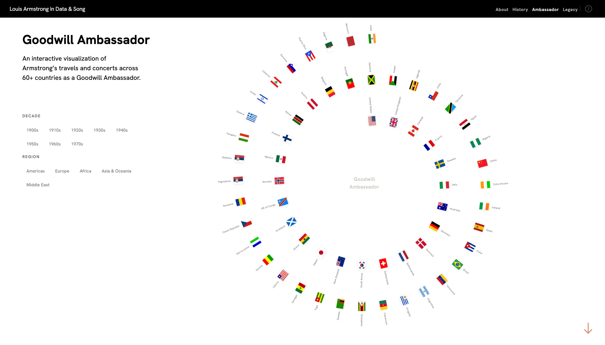
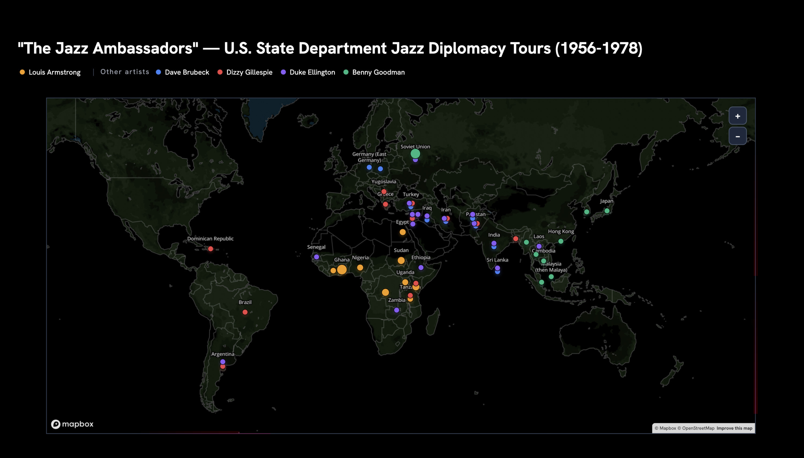
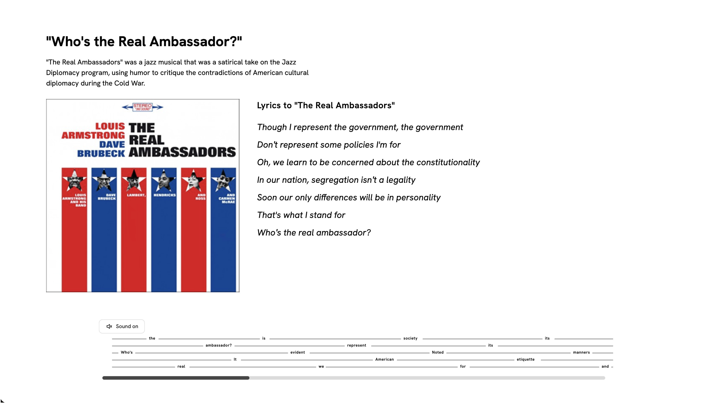
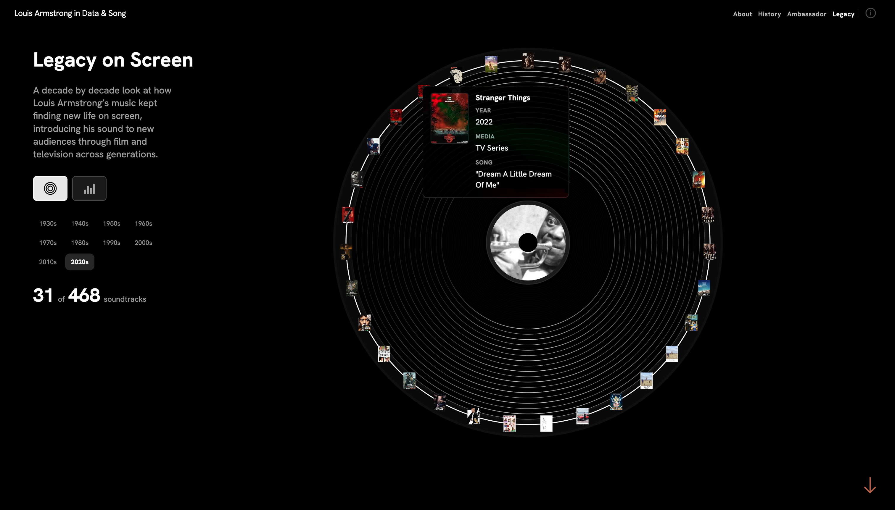

## Written Thesis

## Introduction

Louis Armstrong is most often remembered as one of the most influential musicians in the history of jazz. Yet to understand the full scope of his significance, he must also be recognized as an ambassador. First unofficially, through his early international fame and global touring, and later officially, through his appointment as a U.S. jazz ambassador in Africa between 1960 and 1961. Long before the United States government formally sent him abroad as a representative of American culture, Armstrong had already become one of the first Black international stars whose music, image, and charisma circulated across borders on a global scale. His career therefore offers a powerful lens through which to examine the intersections of music, race, diplomacy, and political power in the twentieth century.

The project asks four central questions: How did Armstrong become an unofficial ambassador of jazz and American culture before his State Department appointment? How did his 1960–1961 Africa tour place him within the political tensions of decolonization, the Cold War, and the Congo Crisis? How did The Real Ambassadors critique the contradictions of American cultural diplomacy by asking who the nation’s “real ambassadors” were? And how has Armstrong’s legacy as an 'ambassdor" continued through the global afterlife of his music, especially the ongoing popularity and rerecording of “What a Wonderful World”? Together, these questions present Armstrong as a figure whose career moved across performance, politics, race, and international diplomacy.

The thesis and accompanying data visualization argue that Armstrong’s ambassadorial role was not secondary to his artistic career, but central to it. From his beginnings at the Colored Waif’s Home for Boys in New Orleans, to his mentorship under Joe “King” Oliver, to his rise as a bandleader, recording artist, film actor, and international celebrity, Armstrong became more than a jazz musician, he became a broader symbol of American culture. He came to embody this idea of American culture abroad, even as the country he represented remained deeply marked by racial segregation and inequality. His life and work reveal how Black performers were often asked to symbolize freedom and democracy on the world stage while being denied full citizenship at home.

This contradiction became especially visible during Armstrong’s State Department sponsored Africa tour of 1960–1961. His travels through countries including Ghana, Nigeria, Egypt, and the Congo took place at a moment when newly independent African nations had become central to Cold War geopolitics. In the Congo, Armstrong arrived during the political upheaval surrounding Patrice Lumumba, decolonization, Katanga, and the international struggle over the country’s mineral wealth. His presence there as a jazz ambassador was therefore inseparable from the larger political tensions of the moment. Armstrong’s role abroad was not simply cultural, it was tied to the ways the United States sought to project influence, goodwill, and racial progress during an era of intense global competition.

Soon after this period, Dave and Iola Brubeck invited Armstrong to participate in The Real Ambassadors, a project originally conceived as a musical and later released as an album. That work asked a defining question, who were America’s “real ambassadors”? Through satire and performance, The Real Ambassadors exposed the contradictions of Cold War cultural diplomacy by suggesting that Black musicians, not formal diplomats, were often the people most responsible for carrying the nation’s image abroad. Armstrong’s participation gave the work particular significance, because he had already lived the tensions it described.

If The Real Ambassadors made visible the political contradictions, “What a Wonderful World” preserved Armstrong in our global memory as a voice of human connection and universal hope. Its continued popularity and rerecording by later artists demonstrate that Armstrong’s work as a musical ambassador did not end with Cold War diplomacy, but continues into the present through cultural memory and international sound.

By combining archival research, political history, music history, and data visualization, this thesis reframes Louis Armstrong as more than a jazz icon. It positions him as a foundational cultural figure through whom broader questions of race, diplomacy, performance, surveillance, and American identity can be understood. To study Armstrong as ambassador is to study the ways music moved through systems of power, and the way one Black artist came to represent, challenge, and outlast the world that first sent him abroad.

The research draws from archival and historical materials from institutions including the Louis Armstrong House Museum, the Louis Armstrong Educational Foundation, the Schomburg Center for Research in Black Culture, public FBI records, discographies, and media archives. These sources are translated into a series of visual and analytical frameworks, including timelines, network diagrams, geographic maps, and custom charts. The visualizations trace Armstrong’s early career and relationship with King Oliver, his rise as a bandleader and entertainer, his global travel, his official Africa tour, his presence in the Congo during political turmoil, and his later artistic engagement with diplomacy in The Real Ambassadors. Additional visualizations place him alongside other jazz ambassadors and map the broader institutional world of U.S. cultural diplomacy.

Abroad, Armstrong was celebrated as a symbol of freedom, creativity, and goodwill. At home, he lived within a nation structured by racism and was subject to government scrutiny. The Real Ambassadors turned this contradiction into art, while “What a Wonderful World” extended Armstrong’s ambassadorial voice into a later era, allowing his message to continue circulating globally long after the official Jazz Ambassador program had ended. By bringing together music history, political history, and data visualization, this project offers a new interpretation of Louis Armstrong as one of the most important cultural ambassadors of the twentieth century.

### Sources

Louis Armstrong House Museum 
Louis Armstrong Educational Foundation 
Schomburg Center for Research 
Public-domain audio archives 1900-1925 
"Heart Full of Rhythm: The Big Band Years of Louis Armstrong". Oxford University Press, 2020. 
"Stomp Off, Let's Go: The Early Years of Louis Armstrong," Ricky Riccadi, Oxford University Press, 2025.  
"What a Wonderful World: The Magic of Louis Armstrong's Later Years", Ricky Riccadi,Pantheon Books, 2011. 

### Data Sources

Louis Armstrong House Museum 
IMDB 
Secondhandsongs.org 
Public archives of Armstrong's early recordings 
