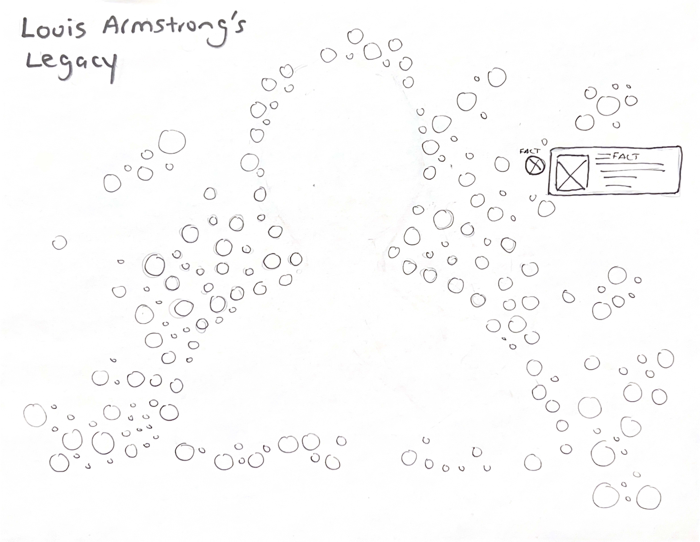
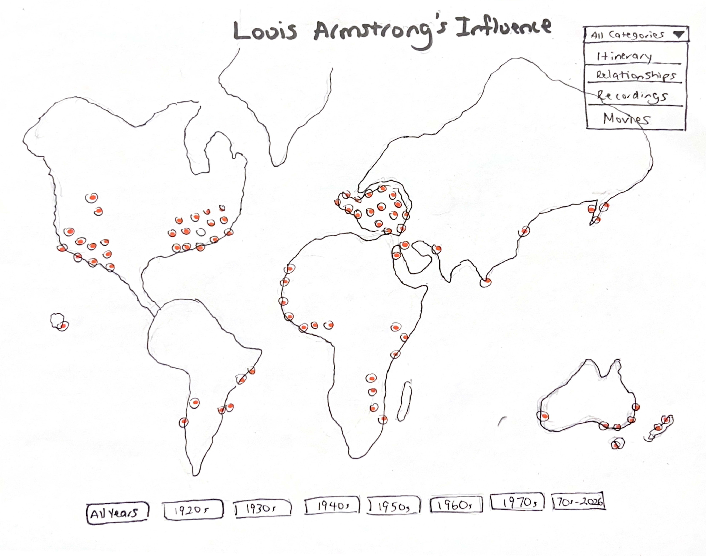
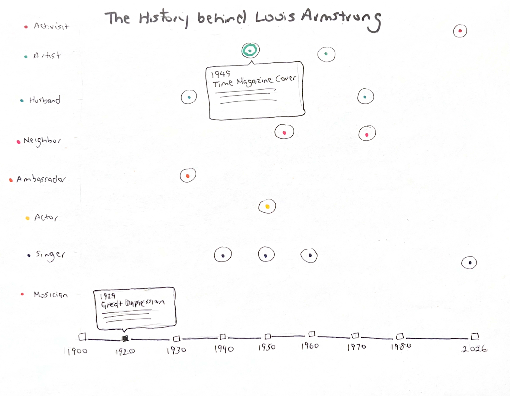
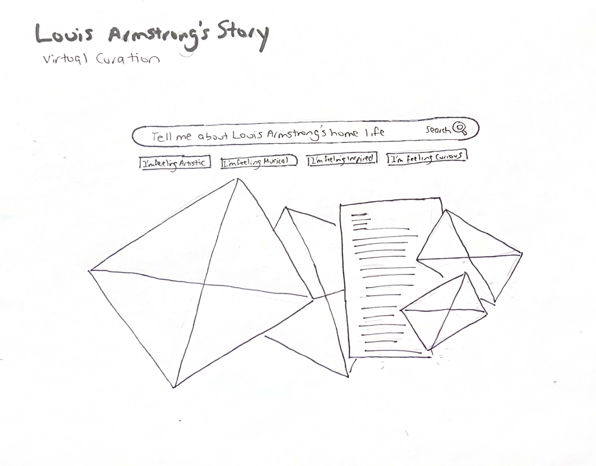
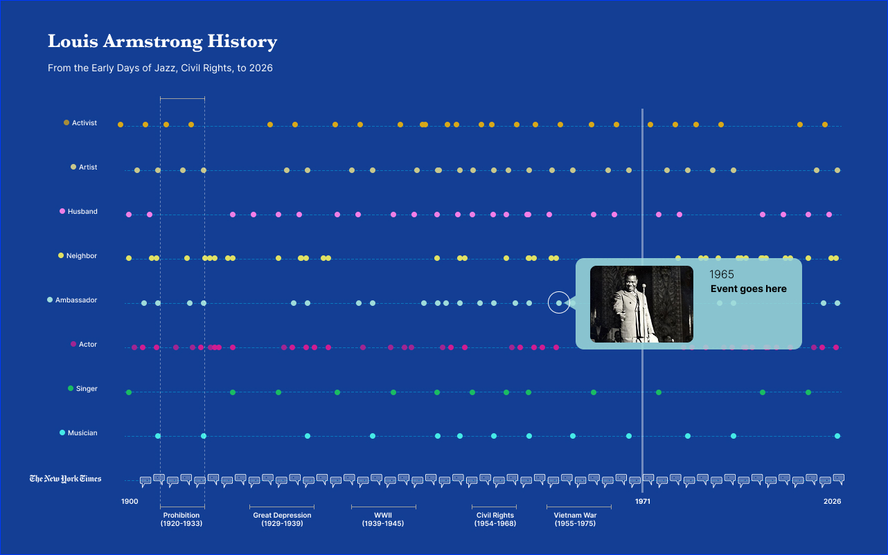
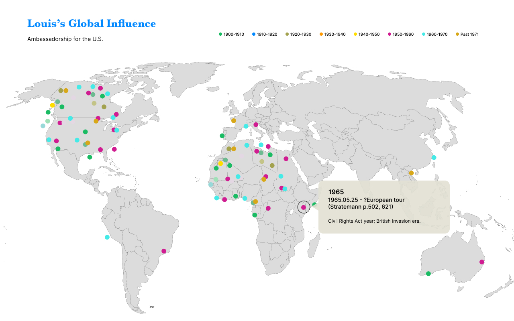
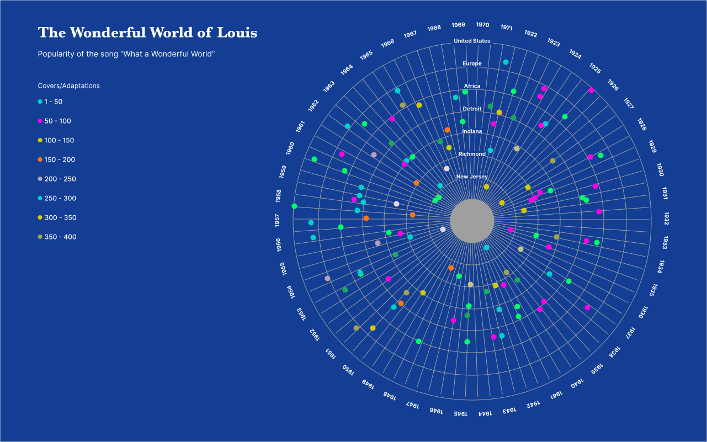
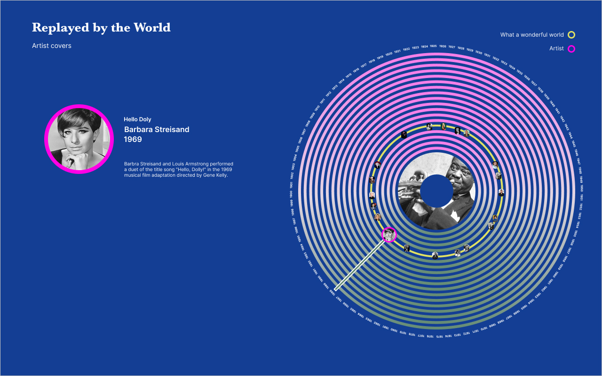

# Sketches and Visualizations for Thesis

# Anatomy of an Artist

 

## Louis Armstrong: A Data Portrait in 2000 Facts

#### Visualization: custom

Description: Louis Armstrong’s life as 2000 facts that can be discovered. Masked around an iconic silhouette of Louis Armstrong’s head and shoulders, these facts are searchable. Louis Armstrong's name is recognizable but most do not know who he was and what he accomplsied throughtout his life and beyond. This visualization will show who Armstrong is through facts that are well known and other facts that less commonly known.

## Louis Armstrong’s World Tour: A Map of Influence

#### Visualization: map

Description: The enormity of Louis Armstrong's life and influence across time and space. He performed in many cities across the world and his influence is still felt today. This map will show the locations of Armstrong's performances and the influence he had on other musicians and artists.

## The History Behind Louis Armstrong

#### Visualization: timeline

Description: The chronological journey of Louis Armstrong's life and career. This timeline will show the key events in Armstrong's life, including his birth, early life, career milestones, and legacy. It will also show the role history played on decisions Louis Armstrong made. With events such as the Great Depression, World War II, and the Civil Rights Movement, Armstrong's life and career were shaped by the historical context in which he lived. This timeline will show how these events influenced Armstrong's decisions and how he navigated the challenges of his time.

## Discovering Armstrong: A Randomized Curation

#### Visualization: virtual curation

Description: This data visualization presents Louis Armstrong's life and work in an interactive virtual curation format. Users can explore his musical legacy through curated collections of performances, recordings, and historical artifacts.

## The Louis Armstrong Ripple Effect: A Network of Influence

#### Visualization: network graph

Description: This visualization shows Louis Armstrong’s legacy as a single continuous sound wave. Each vertical bar represents one original song, arranged chronologically, with the height indicating how many cover versions it has generated. Larger bars reflect songs with greater cultural resonance. Together, the waveform illustrates how his music continues to echo across generations.

# Design Visualizations for Thesis

# Anatomy of an Artist

 

## Louis Armstrong: A Data Portrait in 1901 Facts

#### Visualization: custom

Description: Louis Armstrong’s life as 2000 facts that can be discovered. Masked around an iconic silhouette of Louis Armstrong’s head and shoulders, these facts are searchable. Louis Armstrong's name is recognizable but most do not know who he was and what he accomplsied throughtout his life and beyond. This visualization will show who Armstrong is through facts that are well known and other facts that less commonly known.

## Louis Armstrong Opinions

#### Visualization: custom

Description: This visualization will show the opinions of Louis Armstrong. It will show the opinions of people who knew him, people who were influenced by him, and people who have studied him. This visualization will show the different perspectives on Louis Armstrong and how he is viewed by different people.

## The History Behind Louis Armstrong

#### Visualization: timeline

Description: The chronological journey of Louis Armstrong's life and career. This timeline will show the key events in Armstrong's life, including his birth, early life, career milestones, and legacy. It will also show the role history played on decisions Louis Armstrong made. With events such as the Great Depression, World War II, and the Civil Rights Movement, Armstrong's life and career were shaped by the historical context in which he lived. This timeline will show how these events influenced Armstrong's decisions and how he navigated the challenges of his time.

## Louis Armstrong’s World Tour: A Map of Influence

#### Visualization: map

Description: The enormity of Louis Armstrong's life and influence across time and space. He performed in many cities across the world and his influence is still felt today. This map will show the locations of Armstrong's performances and the influence he had on other musicians and artists.

## Louis Armstrong’s Original Songs: A Network of Influence

#### Visualization: line charts

Description: This visualization will show the influence of Louis Armstrong's original songs. It will show how many cover versions each song has generated and how many people have been influenced by each song.

## Louis Armstrong’s What a Wonderful World

#### Visualization: custom

Description: This visualization will show the influence of Louis Armstrong's song "What a Wonderful World". It will show how many cover versions the song has generated and how many people have been influenced by this song.

## Louis Armstrong’s Re-recordings

#### Visualization: custom

Description: This visualization will show the impact of Louis Armstrong's re-recordings and how they continue to influence people today.

